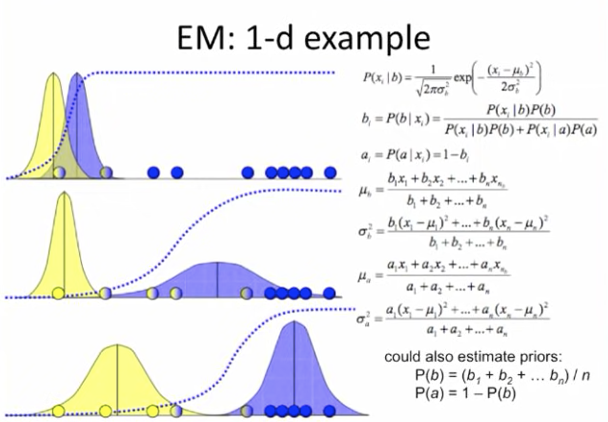
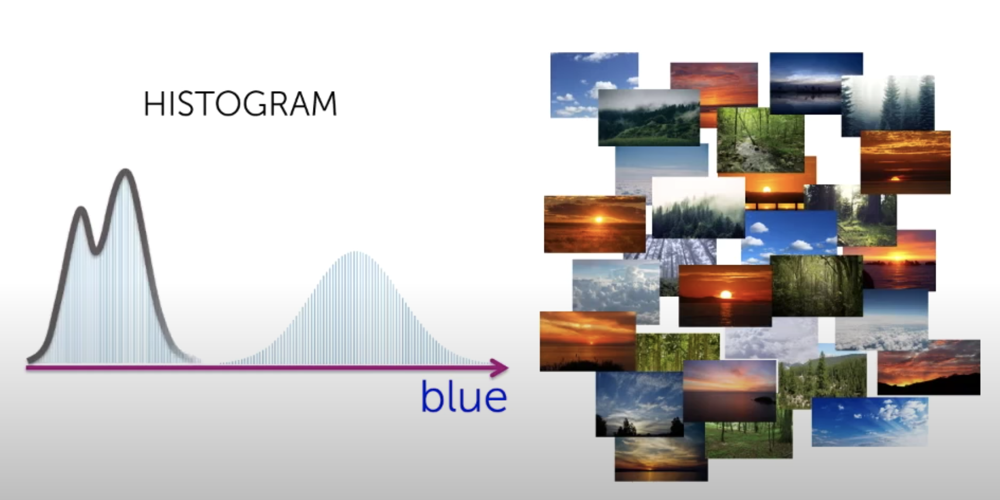
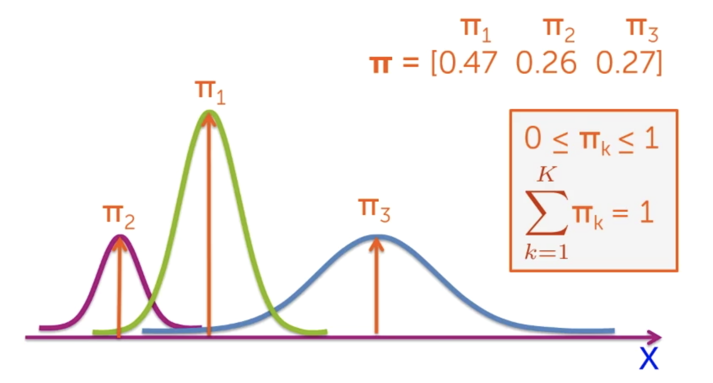

### Unsupervised learning

a. Clustering
- K-means:
    - Randomly assign k-means to start. Assign each data point to the nearest mean. Then update the values of each mean with the mean of all the data points in its cluster. Repeat assignment and update. The algorithm converges when no assignments change. Not guaranteed to find the optimal solution.
- Expectation maximization:
    - Derive a maximum likelihood estimation (infer parameters like mean, variance) for latent (unobserved) variables
    - https://youtube.com/playlist?list=PLBv09BD7ez_4e9LtmK626Evn1ion6ynrt
    - Algorithm:
        - Start with randomly placed Gaussians
        - E-step: Find probability (Bayes' rule) each point belongs to each cluster (soft assignments, not hard assignments like K-means, i.e.- 0.75/0.25 intead of 1/0)
        - M-step: Adjust mean and variance for each cluster to fit points assigned to them
        - Iterate until convergence
    - 
    - Mostly generalizes to more dimensions, but need to look into covariance vs. variance
    - as with K-means, there are ways to deduce how many Gaussians you are fitting, but you need to penalize for larger numbers of Gaussians (the highest likelihood model is each data point has its own Gaussian)
- Gaussian mixture models:
    - https://towardsdatascience.com/gaussian-mixture-models-explained-6986aaf5a95
    - https://youtu.be/DODphRRL79c
    - 
    - Think of this histogram as three separate Gaussians correpsonding to image classification clusters instead of an oddly shaped distribution
    - Weighted average of the categoric specific densities for the mixture density
    - The weights are pi, add up to 1
    - 
    - So each component Gaussian is represented by a mean, variance, and mixture component
